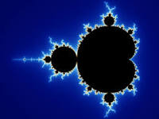

# Project 5
## Multiprocessor Real-Time Fractal Generation

Objective was to write a Mandelbrot fractal generator. Displays a fractal between -2.5-1i and 1+1i, then identifies an "interesting" point to zoom in on. Subsequent frames are in a 4:3 aspect ratio.

One processor identifies zoomp oint and communicates it to the other. At each zoom level the frame is re-rendered. Scaled up from one processor to four processors. Algorithim is parallelized by assigning an equal number of pixels to each processor

